# Tutorial: Stable Diffusion — Generations at a Glance

Introduction to Stable Diffusion

The results of finetuning of SD3.5 looks really good and features like eye and hair passed to the generated images, compared to the same promt used for baseline model before finetuning. A realistic image was also generate and the color of hair was correctly represented except eyes but redish eyes might be difficult to be represented for realistic style since it is not common. The results of finetuning of SD1.5 can be found below as well. 

Seed: 77
<table>
  <tr>
    <th align="center"><b>Anime reference</b></th>
    <th align="center"><b>SD3.5 anime kusanagi</b></th>
    <th align="center"><b>SD3.5 anime ohwx kusanagi</b></th>
    <th align="center"><b>Finetunned "anime ohwx kusanagi"</b></th>
  </tr>
  <tr>
    <td align="center">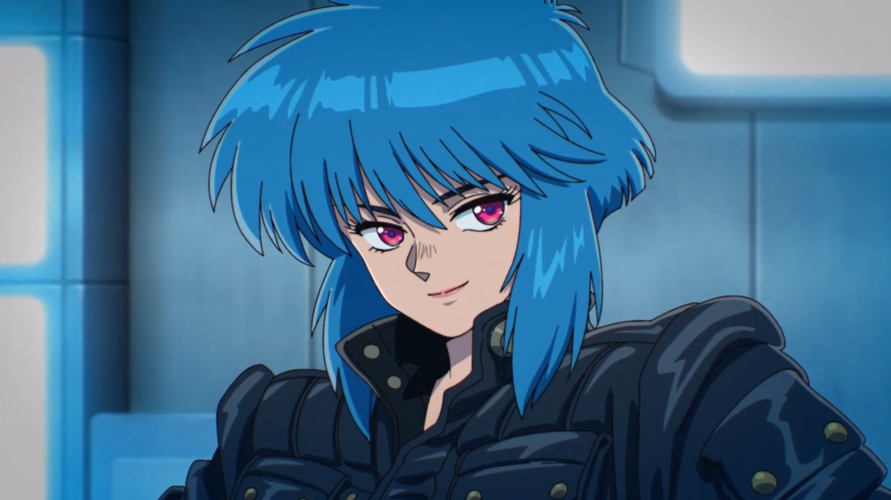</td>
    <td align="center">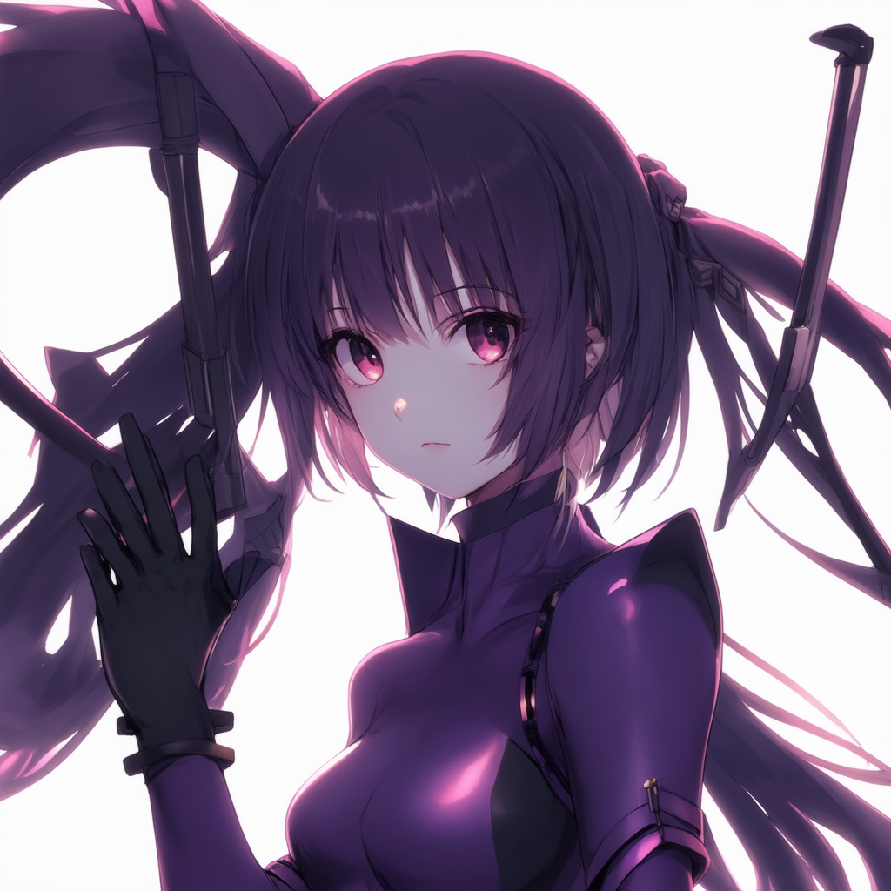</td>
    <td align="center">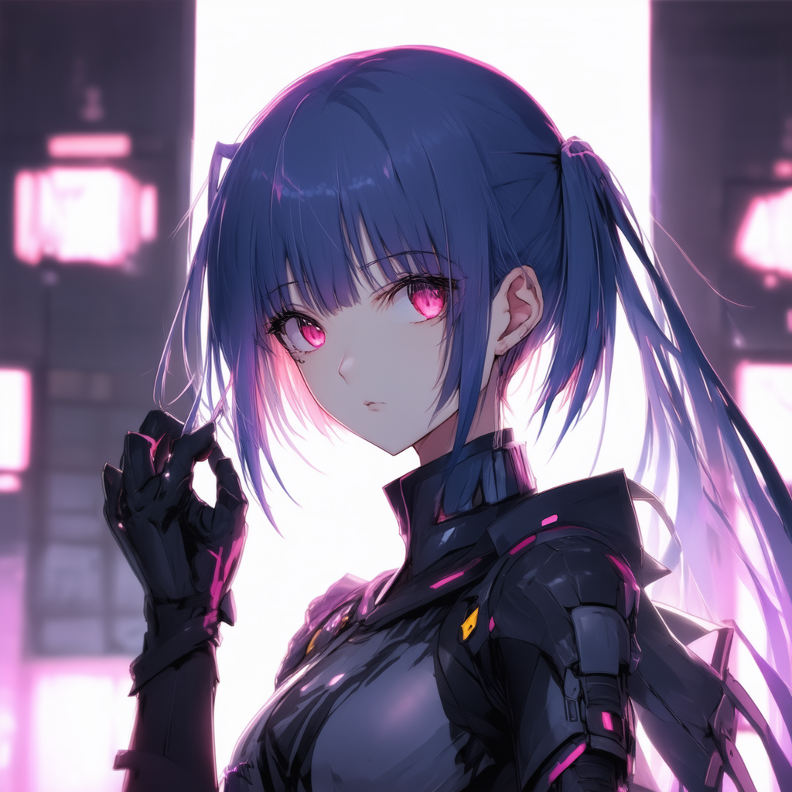</td>
    <td align="center">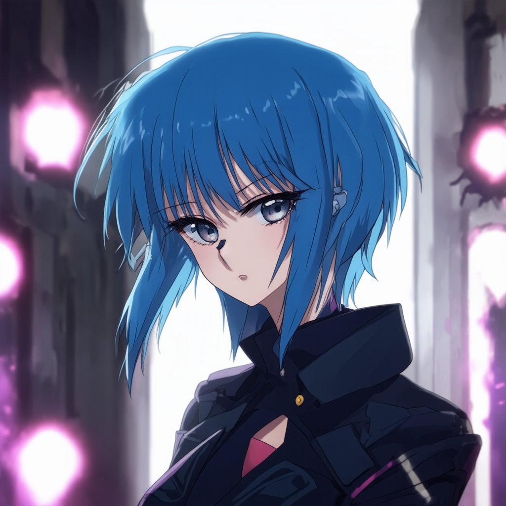</td>
  </tr>
</table>

Seed: 42
<table>
  <tr>
    <th align="center"><b>Anime reference</b></th>
    <th align="center"><b>SD3.5 anime kusanagi</b></th>
    <th align="center"><b>SD3.5 anime ohwx kusanagi</b></th>
    <th align="center"><b>Finetunned "anime ohwx kusanagi"</b></th>
  </tr>
  <tr>
    <td align="center"></td>
    <td align="center">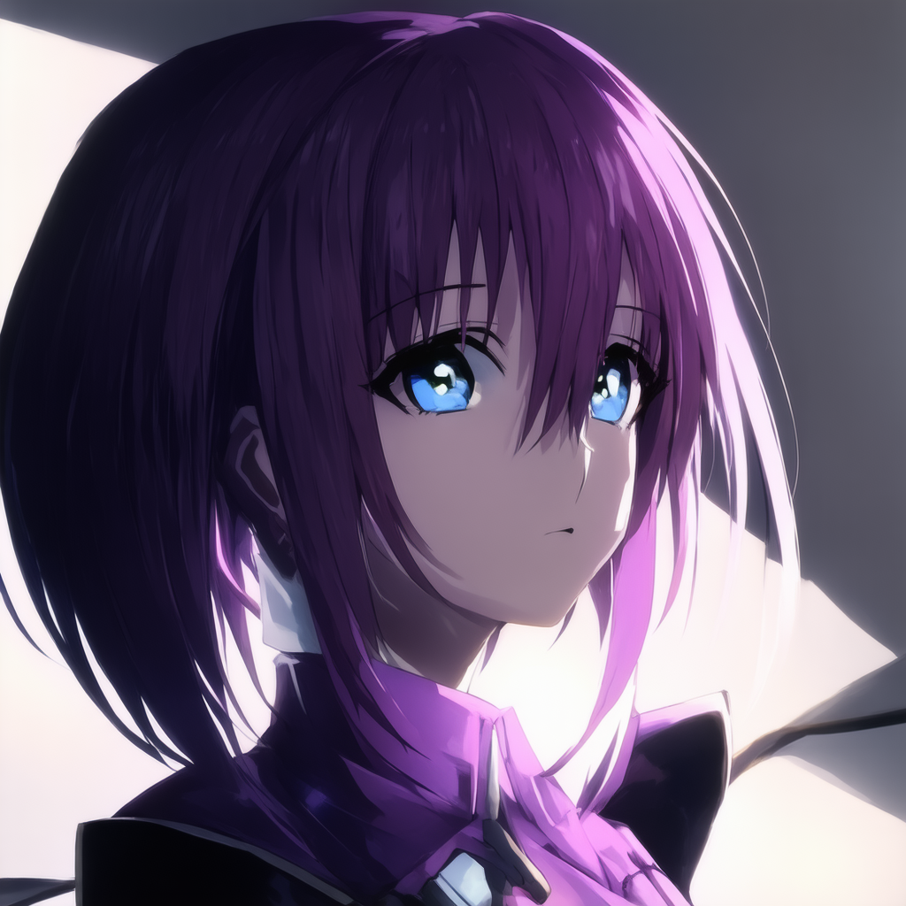</td>
    <td align="center">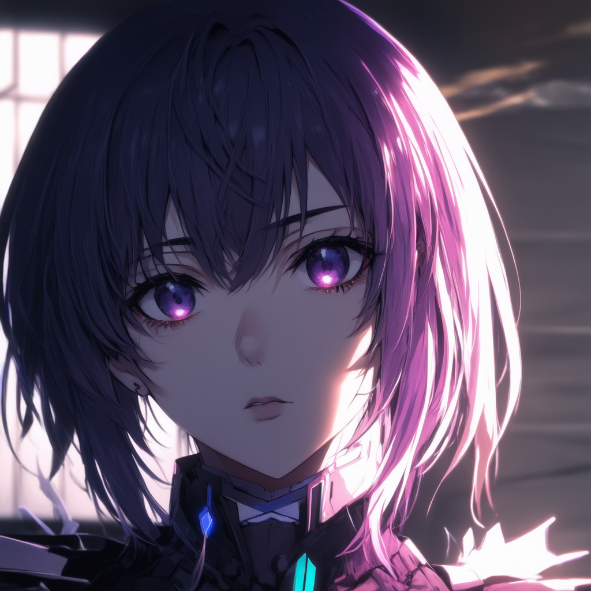</td>
    <td align="center">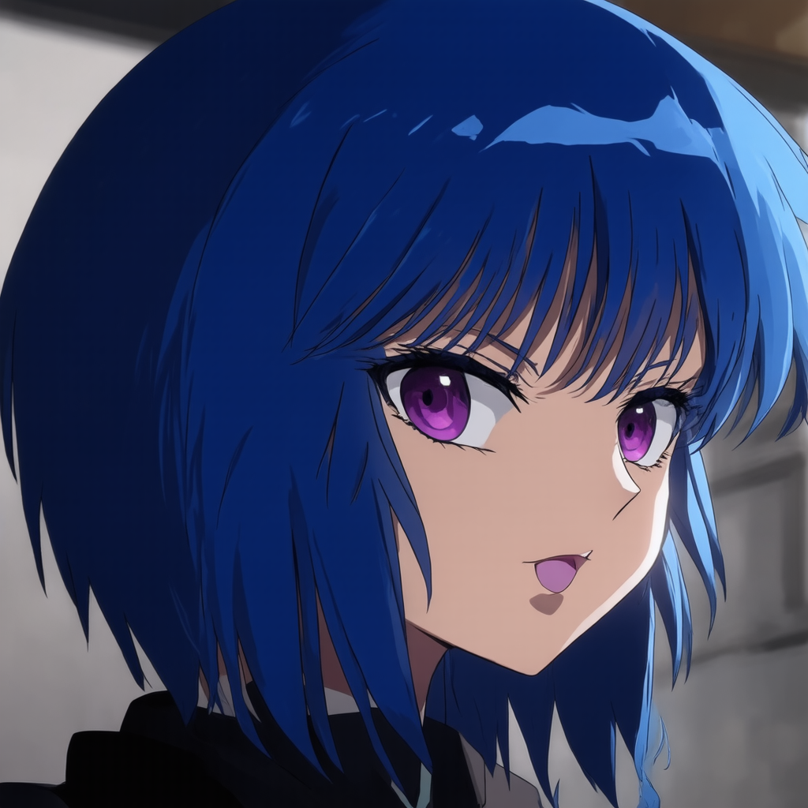</td>
  </tr>
</table>

| Feature | SD 1 (v1.x) | SD 2 (v2.x) | SD 3 (v3.x) |
|---|---|---|---|
| **Architecture** | Latent Diffusion + UNet (~865 M params) + VAE | Same latent-diffusion core with larger UNet (≈860 M–1 B), tweaked attention blocks, optional depth & inpaint heads | Diffusion-Transformer (DiT-like) + Mixture-of-Experts, 800 M → 8 B params |
| **Text encoder** | CLIP ViT-L/14 (OpenAI) | OpenCLIP ViT-G/14 (larger, open) | Triple encoder: CLIP-L + CLIP-G + T5-XXL — better long prompts & text rendering |
| **Latent => pixel** | 4x64×64 => 3x512×512 | 4x64/96×64/96 => 3x768×768 | 16x128×128 => 3x1024×1024 |
| **Latent channels** | 4 | 4 | 16 |
| **VAE scale** | 0.18215 | 0.18215 | scale 1.5305, shift 0.0609 |
| **Training data** | LAION-2B subset (~2.3 B images) | LAION-5B aesthetic-filtered; fewer copyrighted terms | Proprietary + licensed stock; designed for accurate text & multi-object composition |
| **New capabilities** | First public T2I model; fast, ~4 GB VRAM | Sharper native images; Depth-to-Image; Inpainting; better anatomy | Much better spelling & logos; complex multi-subject scenes; fewer artifacts |
| **Safety / filters** | Opt-in NSFW filter script | Heavier prompt + image filters; many artist names removed | Strict alignment & watermarking; gated API at launch |

## Content

- Weight-compatible models implemented:
  - [x] **SD1.x**

<table>
  <tr>
    <th align="center"><b>txt2img</b></th>
    <th align="center"><b>Original</b></th>
    <th align="center"><b>img2img</b></th>
  </tr>
  <tr>
    <td align="center">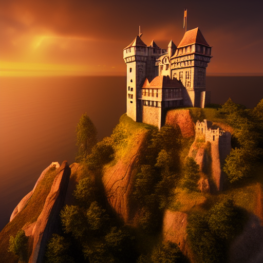</td>
    <td align="center">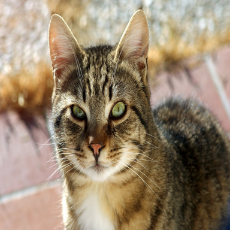</td>
    <td align="center">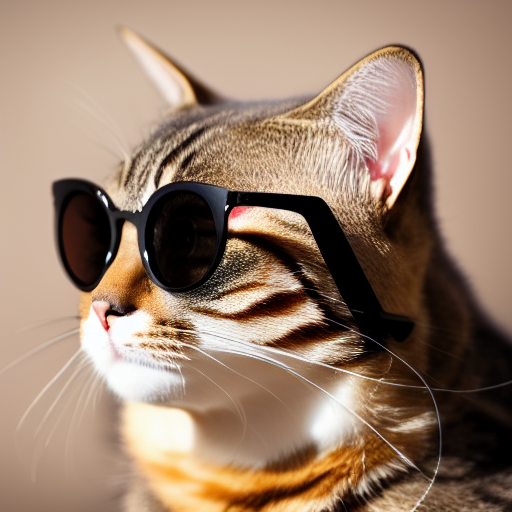</td>
  </tr>
</table>

  - [x] **SD2.x**

<table>
  <tr>
    <td align="center"><b>txt2img</b></td>
    <td align="center"><b>Original</b></td>
    <td align="center"><b>img2img</b></td>
  </tr>
  <tr>
    <td align="center"></td>
    <td align="center"></td>
    <td align="center">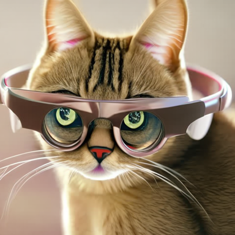</td>
  </tr>
</table>

  - [x] **SD3.x**
<table>
  <tr>
    <td align="center"><b>txt2img</b></td>
  </tr>
  <tr>
    <td align="center"></td>
  </tr>
</table>

  - [x] **SD1.x: DreamBooth + LoRA**

<table>
  <tr>
    <th align="center"><b>Reference</b></th>
    <th align="center"><b>Baseline</b></th>
    <th align="center"><b>Finetunned SD1.5</b></th>
    <th align="center"><b>Finetunned SD3.5</b></th>
  </tr>
  <tr>
    <td align="center"></td>
    <td align="center">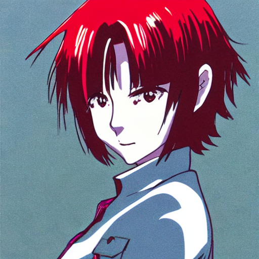</td>
    <td align="center">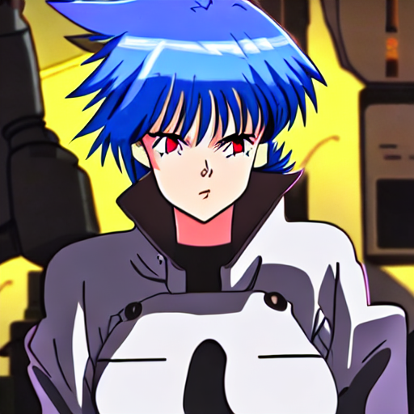</td>
    <td align="center">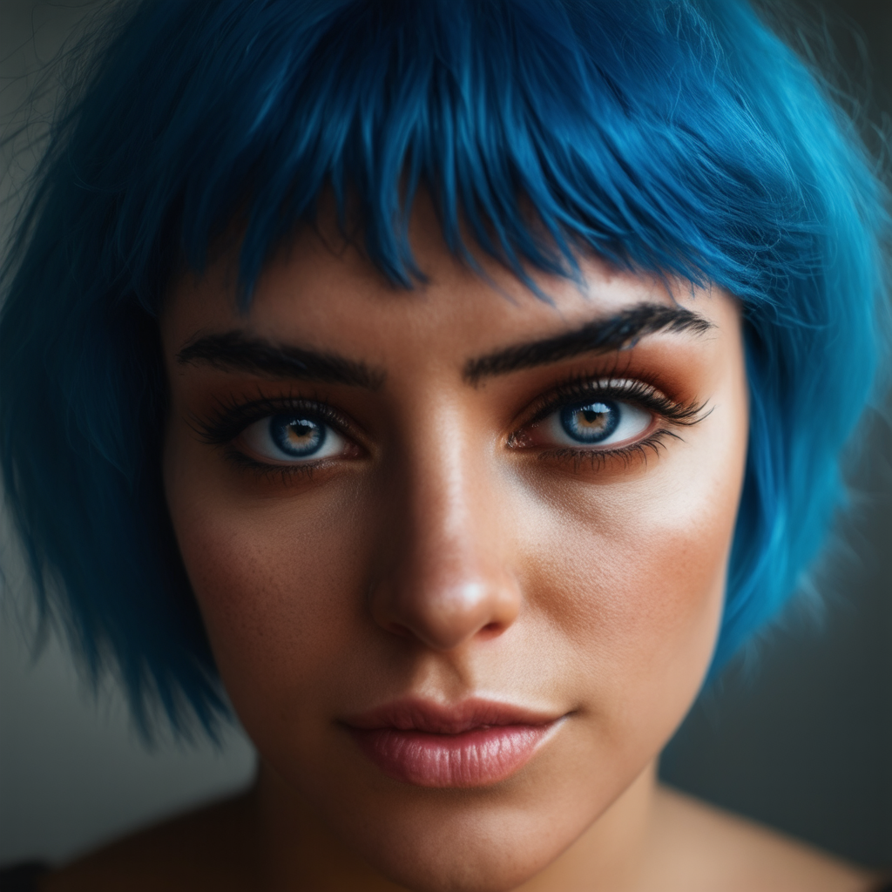</td>
  </tr>
</table>

- Finetuning:
  - [x] DreamBooth
  - [x] LoRA
  - [x] LoRA + DreamBooth

Process:
```bash
# uv is used for this project
uv sync
```
Generate data for prior preservation:
```python
uv run python generate_data.py
```
Finetune the model:
```python
uv run python dreamboorh_lora_sd15.py
```
Inference:
```python
uv run python inference.py 
```
